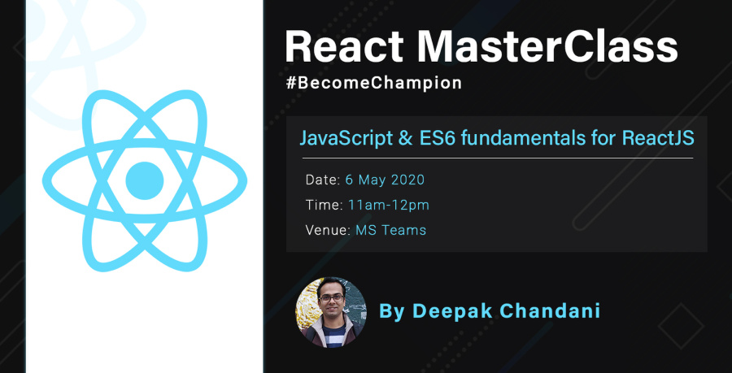

<h1 align="center">
  
   
</h1>

<h3 align="center">  
  <a href="https://radiant-sands-51546.herokuapp.com/profile/deepak.chandani">
  <b>Developer Profile</b>
  </a>
   
</h3>

<h3 align="center">JavaScript & ES6 for building effective React Applications</h3>

### Info
An interactive quiz based learning session to understand ES6 concepts & apply those concepts to solve quiz questions.

### Contents
 - ES6 concepts
   - var vs let vs const
   - Destructuring (Object & Array)
   - Rest & Spread operator
   - Modules in ES6 (import/export)
   - Arrow functions
 - Array methods
   - `find()`, `includes()`, `map()`, `filter()`, `reduce()`, `concat()`, `push()`, `pop()`
 - Function methods
   - `apply()`, `call()`, `bind()`
4)	Promises & async/await
